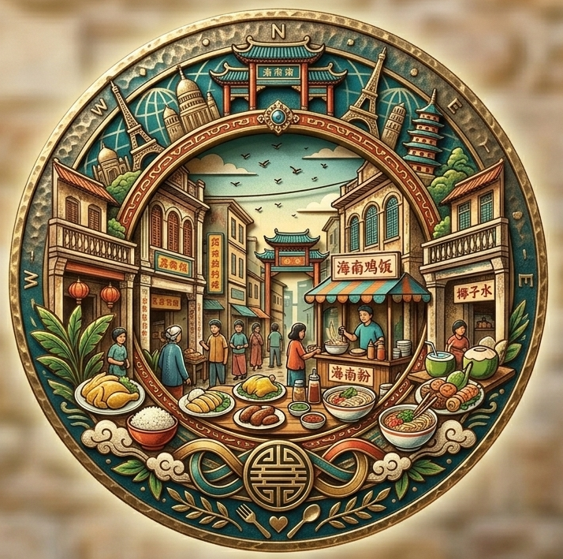

<p align="center">
  <a href="README.md">中文</a> · <a href="README.en.md">English</a> · <a href="README.ja.md">日本語</a>
</p>

<p align="center">
  <a href="https://streetcornerfoodie.com" aria-label="Street Corner Foodie">
    
  </a>
</p>

# Street Corner Foodie

*Turn into every street corner of the world — taste the city, see the bite.*

**[streetcornerfoodie.com](https://streetcornerfoodie.com)** · A diorama atlas of world street food & cityscapes

---

**Street Corner Foodie** weaves three visual lanes — **Gourmet recipe2** posters, **mini-zine** storybooklets, and **Street View** dioramas — into one explorable web experience: switch countries and cities, then follow a dish from plate to street scene on a single map.

| | |
|---|---|
| Local dev | `cd web && npm install && npm run dev` → http://localhost:4321 |
| Deploy | [docs/DEPLOY.md](docs/DEPLOY.md) · [docs/DEPLOY-R2.md](docs/DEPLOY-R2.md) |
| Docs | [docs/README.md](docs/README.md) · [BRAND.md](BRAND.md) · [AGENTS.md](AGENTS.md) |

---

## UI preview

<p align="center">
  
</p>

### 1 · Landing

Bento home: world map linked to the city card, live weather, poster/zine picks, and brand manifesto.


### 2 · World Atlas

Full-screen map: country/region clusters; focus a pin to sync the landing city card. UI in EN / ZH / JP with three country themes.


### 3 · Posters

Poster gallery: filter by country, province, and flavor; browse **Gourmet recipe2** 3D isometric finals.


### 4 · Mini-Zine

Zine gallery and reader: **mini-zine** six-page narratives, thumbnail paging, and zoom view.


### 5 · Street Explorer

21:9 night dioramas, scene list, time/aspect toggles; each scene includes local food stalls and signage.


---

## Repository layout

```
meishi/
├── asserts/     # posters · zines · street views (local junction; see .gitignore)
├── docs/        # regional docs · style specs · screenshots above
├── web/         # Astro 4 frontend
├── BRAND.md
└── AGENTS.md
```

---

## License

| Content | License |
|---------|---------|
| Code (`web/`, scripts, doc text, etc.) | [MIT](LICENSE) |
| Visual assets (posters / zines / street views / brand art / README screenshots) | [Non-commercial](LICENSE-ASSETS.md) |

© 2026 [Street Corner Foodie](https://streetcornerfoodie.com)
