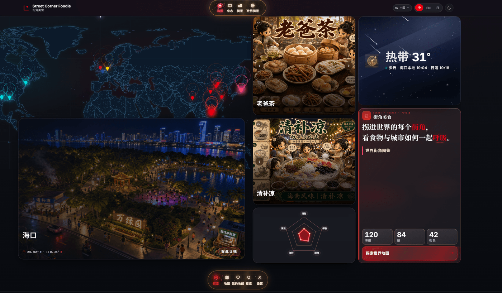
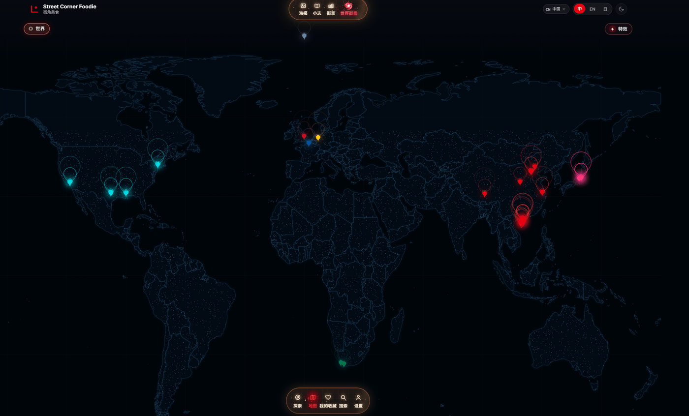
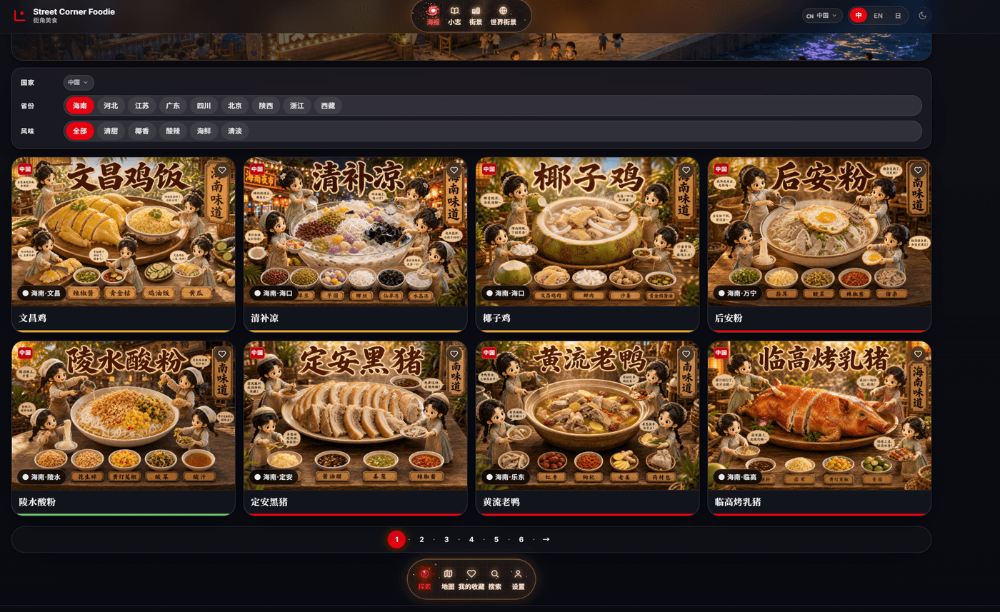
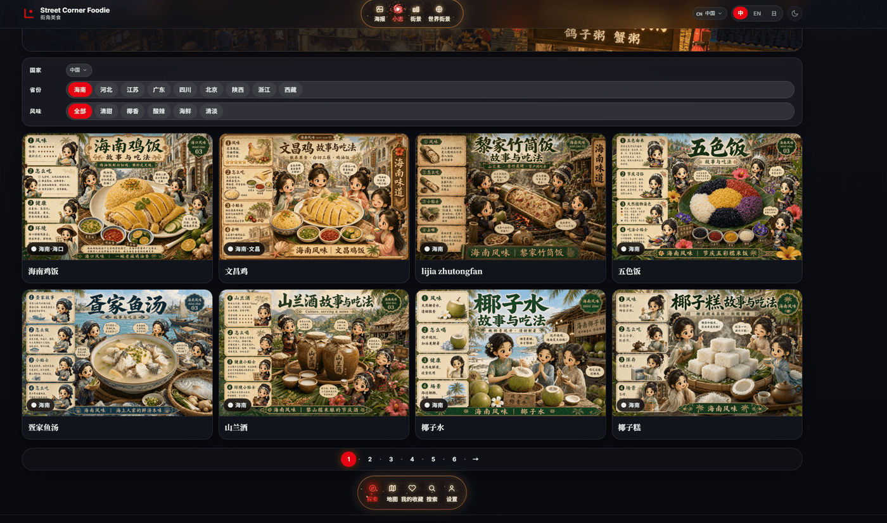
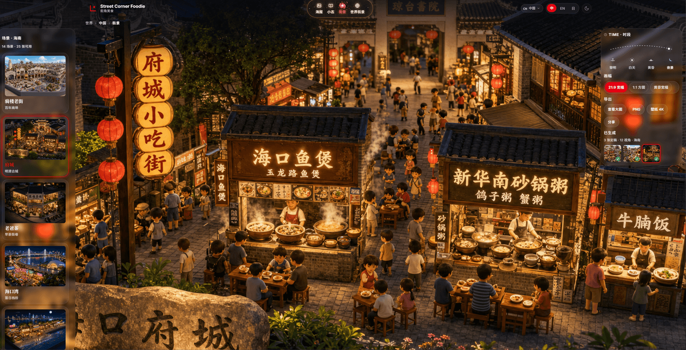

# Street Corner Foodie · 街角美食

*Turn into every street corner of the world — taste the city, see the bite.*  
*拐进世界的每个街角，看食物与城市如何一起呼吸。*

**[streetcornerfoodie.com](https://streetcornerfoodie.com)** · A diorama atlas of world street food & cityscapes

---

**Street Corner Foodie** 把 **Gourmet recipe2 海报**、**mini-zine 小志**、**Street View 街景** 三种画风串成可浏览、可探索的 Web 体验：按国家与城市切换，从菜品到街景一张地图联动。

| | |
|---|---|
| 本地开发 | `cd web && npm install && npm run dev` → http://localhost:4321 |
| 部署 | [docs/DEPLOY.md](docs/DEPLOY.md) · [docs/DEPLOY-R2.md](docs/DEPLOY-R2.md) |
| 文档 | [docs/README.md](docs/README.md) · [BRAND.md](BRAND.md) · [AGENTS.md](AGENTS.md) |

---

## 界面预览

### 1 · 首页 Landing

Bento 首页：世界地图与城市卡联动，实时气温、海报/小志精选格与品牌宣言。



### 2 · 世界街景 · World Atlas

全屏地图：按国家/地区聚合光点，点击聚焦后联动首页城市卡。CN / EN / JP 三语与三国主题色。



### 3 · 美食海报 · Posters

海报画廊：按国家、省份、风味筛选，浏览 **Gourmet recipe2** 3D 等距沙盘定稿。



### 4 · 做法小志 · Mini-Zine

小志画廊与阅读器：**mini-zine** 六页叙事，缩略图翻页与放大查看。



### 5 · 街景探索 · Street Explorer

21:9 宽幅夜景沙盘，场景列表 + 时段/画幅切换；画面含当地饮食摊与店招。



---

## 仓库结构

```
meishi/
├── asserts/     # 海报 · 小志 · 街景（本地 junction，见 .gitignore）
├── docs/        # 地区文档 · 风格规范 · 上方截图
├── web/         # Astro 4 前端
├── BRAND.md
└── AGENTS.md
```

---

© 2026 Street Corner Foodie
